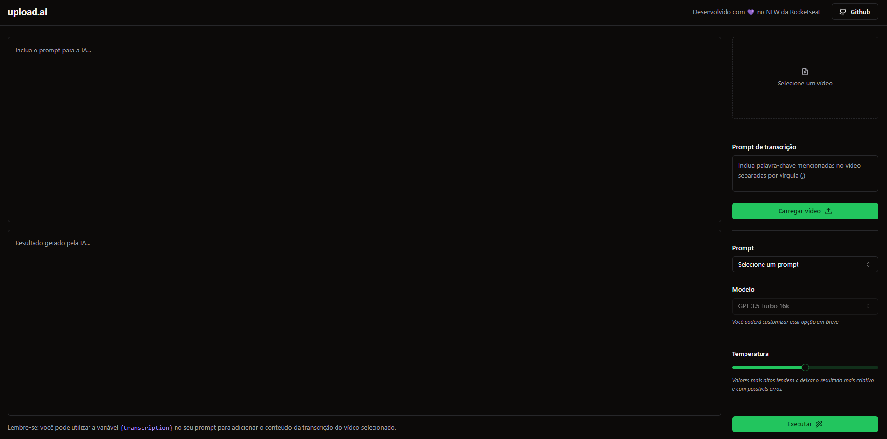

<h1 align="center">Web NLW IA</h1>

O frontend da NLW IA foi desenvolvido durante o evento da Rocketseat no período dos dias 11 a 15 de setembro de 2023. A ideia da aplicação é focado na utilização da inteligência artificial da OpenAI, onde poderemos enviar um vídeo e pedir para a IA descrever algum prompt que pode ser um título ou uma descrição para um vídeo do Youtube.

 

# 🚀 Tecnologias

Projeto desenvolvido com as seguintes tecnologias:

- React JS 
- TypeScript
- Shadecn.ui
- Tailwindcss
- Axios
- Vite JS

 

<h2>Versão Desktop:</h2> 

